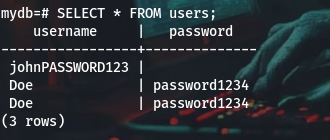

# DATABASE NORMALIZATION AND ACID PROPERTIES

## DATABASE NORMALIZATION

Database normalization is the process organizing data in a database to reduce redundancy. This involves diving large tables into smaller tables and defining relationships between them. Te main goal of database normalization is to reduce the chances of storing duplicate data in a table.

During the process of database normalization we go through different stages known as **Normal forms** where each stage imposes a different set of rules to improve the sructure and performance of the database.

### Normal Forms
As discussed earlier Normal forms are the different stages in database normalization, they include 

- #### First Normal Form **(1NF)**

In 1NF a table must susrify the following conditions:

1. Each cell must hold a single value.
2. Each row/record must be unique

for example:

When collecting user data, each cell must hold a single value in which there should be no single cell holding both the username and password and also each row should be unique in this case each row should have a unique username.

The table is not normalized

In the first row the password and username are in the same row and the other two rows are similar which breaks the conditions of 1NF. 
After normalizing the table we should have something like this.

- #### Second Normal Form **(2NF)**
A table must sustify the following to be in 2NF

1. Must sustify all the 1NF conditions.
2. No partial dependecies.

Partial depencies means that the non-key values does not dependent on the whole composite key but a part of it.
for example:

In the above example the composite key is **(userid roleid)**
The username depends on the **userid** which is part of the composite key and the whole composite key, similar to rolename and department which depend on the roleid which is part of the composite key. This breaks the coditions for a table to be in 2NF. 
After normalizing the table we should have:

In the above, we created a table to hold the roles and the users and finally creates a conjuction table to map the users with their roles. By doing this we have effectively eliminated the partiall dependency.

- #### Third Normal Form **(3NF)**
A table must sustify the fillowing to be in 3NF:

1. The table nust sustify all the 2NF conditions.
2. No transitive dependecy.

What we mean by no transitive dependency is that there should be no non-key values depending on other non-key values.

for example:
Lets take the ROles table from our 2NF example after normalization:

In the above table there is a transitive depedency where the department depends on the rolename and the rolename depends on the roleid. After removing the transitive dependency we gave:

## ACID properties
Acid stands for:

-A = Atomicity: it means that either the entire transaction completes fully or doesn't execute at all.

for example: 

When transfering money from account A to account B. When the trascation is being executed but after reducing the amount in account A it fails before updating the balance in account B. In this case the entire transaction is rolled back and no partial changes are made in the database in this case, no changes will be made to account A since the tranctaction failed.

-C = Consistency: ensures that a database remains in a valid state before and after a transaction.

When transfering money froma Account A which has a balance of ksh 700 to account B and the tranfer fails mid-way, the system should role back and not update any balances. So if if there was a deduction in Account A then the tranfer fails after rolling back the balance of account A should be ksh 700.

-I = Isolation: ensures that multiple transactions can occur concurrently and independenrly without interference.

-D = Durability: ensures that once the transaction has completed execution, the updates and modifications to the database are stored in and written to disk and they persist even if a system failure occurs.

for example:

After updating the balance in account B and the system crashes immediately, the transfer details will still be intact when the system recovers

